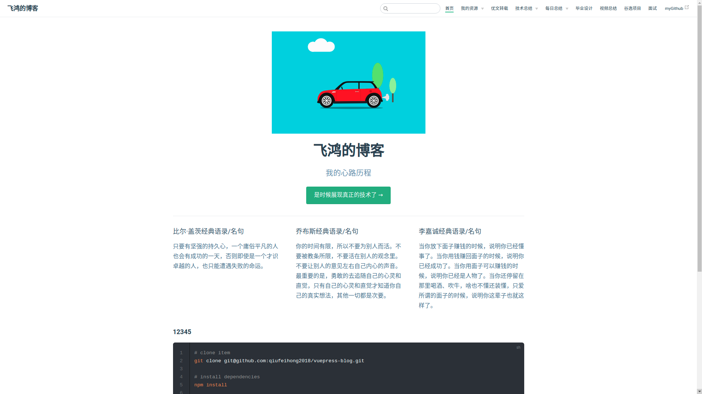
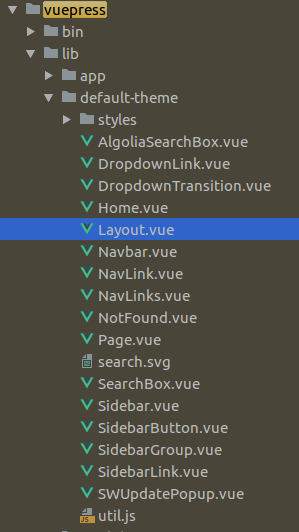
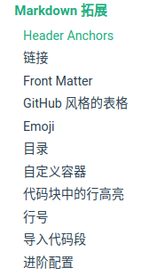

## 手把手带你搭建VuePress的技术博客
[[toc]]
### [vuepress](https://vuepress.vuejs.org/zh/)

这个还是蛮不错的,尤大出品,必属精品.
::: tip what
vuepress是什么?
:::
>Vue 驱动的静态网站生成器

>简洁至上
以 Markdown 为中心的项目结构，以最少的配置帮助你专注于写作。

>Vue驱动
享受 Vue + webpack 的开发体验，可以在 Markdown 中使用 Vue 组件，又可以使用 Vue 来开发自定义主题。

>高性能
VuePress 会为每个页面预渲染生成静态的 HTML，同时，每个页面被加载的时候，将作为 SPA 运行。

具体就不介绍了,详情请看官网[vuepress](https://vuepress.vuejs.org/zh/)

既然是手把手,当然我得一步一步下来

### 全局安装

npm install -g vuepress

### 创建项目vuepess-blog
```markdown
mkdir vuepress-blog
```

### 项目初始化
```markdown
npm init -y
```
完了,会创建一个package.json
```js
{
  "name": "vuepess-blog",
  "version": "1.0.0",
  "description": "",
  "main": "index.js",
  "scripts": {
    "test": "echo \"Error: no test specified\" && exit 1"
  },
  "keywords": [],
  "author": "",
  "license": "ISC"
}
```

### 其中添加主README.md文件
```markdown
touch README.md
```
在这个文件中主要写一些这是什么项目啊,这个项目有什么特性啊,这个项目怎么启动啊等等

```markdown
# vuepress-blog
> a vuepress blog about qiufeihong

### Build Setup


# clone item
git clone git@github.com:qiufeihong2018/vuepress-blog.git

# install dependencies
npm install

# serve with hot reload at localhost:8080
npm run dev

# build for production with minification
npm run build

# deploy https://username.github.io
npm run d

# pm2 deploy
npm run server 


### main page


### feature
- [x] 可以统计阅读量
- [x] 支持评论
- [ ] Algolia搜索
- [ ] 在 GitHub 上编辑此页
- [ ] SEO


```

###  添加docs文件夹
```markdown
mkdir docs
```
这个文件夹中主要放些你的配置和所写的博客内容

###  在docs文件夹中创建.vuepress文件夹
```markdown
cd docs
mkdir .vuepress
```
这个文件夹中你就可以放[配置](https://vuepress.vuejs.org/zh/config/)了
#### 新建config.js文件

主要配置都写在这里
```js
module.exports = {
    title: '飞鸿的博客',
    description: '我的心路历程',
    dest: './dist',
    port: '7777',
    head: [
        ['link', {rel: 'icon', href: '/logo.gif'}]
    ],
    markdown: {
        lineNumbers: true
    },
    themeConfig: {
        nav: require('./nav'),
        sidebar: require('./sidebar'),
        sidebarDepth: 2,
        lastUpdated: 'Last Updated',
        searchMaxSuggestoins: 10,
        serviceWorker: {
            updatePopup: {
                message: "New content is available.",
                buttonText: 'Refresh'
            }
        },
        editLinks: true,
        editLinkText: '在 GitHub 上编辑此页 ！'
    },
    plugins: [
        [
            '@vuepress/register-components',
            {
                componentsDir: './components'
            }
        ]
    ]
}

```

#### 新建导航栏nav.js

导航栏配置放在这个文件中
```js
module.exports = [
    {
        text: '首页', link: '/'
    },
    {
        text: '学习资源',
        items: [
            {text: '前端学习路线', link: 'http://www.imooc.com/article/261756'},
            {text: '前端学习视频', link: '/front-end-video/'},
            {text: '全栈', link: '/resource/'}
        ]
    },
    {
        text: '优文转载', link: '/reprint/'
    },
    {
        text: '技术总结',
        items: [
            {
                text: 'mongo', link: '/technical-summary/mongo/'
            },
            {
                text: 'vue-webpack', link: '/technical-summary/vue-webpack/'
            },
            {
                text: 'Vue.js 组件精讲', link: '/technical-summary/vue-component/'
            },
            {
                text: 'ubuntu', link: '/technical-summary/ubuntu/'
            },
            {
                text: 'eslint', link: '/technical-summary/eslint/'
            },
            {
                text: 'nuxt', link: '/technical-summary/nuxt/'
            },
            {
                text: 'node', link: '/technical-summary/node/'
            },
            {
                text: 'css', link: '/technical-summary/css/'
            },
            {
                text: 'github', link: '/technical-summary/github/'
            },
            {
                text: 'es6', link: '/technical-summary/es6/'
            }

        ]
    },
    {
        text: '视频总结', link: '/video-summary/'
    },
    {
        text: '面试', link: '/interview/'
    },
    {
        text: '官网链接',
        items: [
            {
                text: 'MDN Web 文档', link: 'https://developer.mozilla.org/zh-CN/'
            },
            {
                text: 'Vue.js', link: 'https://cn.vuejs.org/'
            },
            {
                text: 'Nuxt.js', link: 'https://zh.nuxtjs.org/'
            },
            {
                text: 'VuePress', link: 'https://vuepress.vuejs.org/zh/'
            },
            {
                text: 'vue-element-admin', link: 'https://panjiachen.github.io/vue-element-admin-site/zh/'
            },
            {
                text: 'D3', link: 'https://d3js.org/'
            },
            {
                text: 'D2日报', link: 'https://daily.fairyever.com/'
            },
            {
                text: 'element', link: 'http://element-cn.eleme.io/### /zh-CN'
            },
            {
                text: 'iView', link: 'https://www.iviewui.com/'
            },
            {
                text: '前端库', link: 'https://www.awesomes.cn/'
            },
            {
                text: 'TypeScript', link: 'https://www.tslang.cn/index.html'
            },
            {
                text: 'inMap', link: 'http://inmap.talkingdata.com/### /index'
            },
            {
                text: 'Koa', link: 'https://koa.bootcss.com/### context'
            },
            {
                text: 'mongodb', link: 'https://www.mongodb.com/'
            },
            {
                text: '阿里云', link: 'https://www.aliyun.com/?spm=a2c4e.11154921.1280361.1.668724dcivLtu3'
            },
            {
                text: '百度地图', link: 'http://lbsyun.baidu.com/index.php?title=%E9%A6%96%E9%A1%B5'
            },
            {
                text: 'ikcamp', link: 'https://www.ikcamp.com/'
            },
            {
                text: 'Easy Mock', link: 'https://www.easy-mock.com/'
            },
            {
                text: '码云', link: 'https://gitee.com/'
            },
            {
                text: '图灵社区', link: 'http://www.ituring.com.cn/'
            },
            {
                text: 'Valine', link: 'https://valine.js.org/'
            }
        ]
    },
    {
        text: '个人主页',
        items: [
            {
                text: 'GitHub', link: 'https://github.com/qiufeihong2018'
            },
            {
                text: '掘金', link: 'https://juejin.im/user/5bf4d63cf265da61561ee241/posts'
            },
            {
                text: 'CSDN', link: 'https://blog.csdn.net/weixin_38465623'
            },
            {
                text: 'segmentfault', link: 'https://segmentfault.com/u/qiufeihong2018'
            },
            {
                text: '知乎', link: 'https://www.zhihu.com/people/chou-fei-hong/activities'
            },
            {
                text: '简书', link: 'https://www.jianshu.com/'
            },
            {
                text: 'v2ex', link: 'https://www.v2ex.com/'
            }
        ]
    }
]

```

#### 创建侧边栏sidebar.js

侧边栏配置放在这里,将其他文件夹中的侧边栏配置require进来
```js
module.exports = {
    '/graduation-project/': require('../graduation-project/sidebar'),
    '/technical-summary/github/': require('../technical-summary/github/sidebar'),
    '/technical-summary/vue-component/': require('../technical-summary/vue-component/sidebar'),
    '/interview/': require('../interview/sidebar'),
    '/reprint/':require('../reprint/sidebar')
}

```

### 在docs文件夹下面创建一个README.md文件

默认的主题提供了一个首页,跟VuePress一样的主页

```markdown

home: true
heroImage: /logo.jpg
actionText: 快速上手 →
actionLink: /zh/guide/
features:
- title: 简洁至上
  details: 以 Markdown 为中心的项目结构，以最少的配置帮助你专注于写作。
- title: Vue驱动
  details: 享受 Vue + webpack 的开发体验，在 Markdown 中使用 Vue 组件，同时可以使用 Vue 来开发自定义主题。
- title: 高性能
  details: VuePress 为每个页面预渲染生成静态的 HTML，同时在页面被加载的时候，将作为 SPA 运行。
footer: MIT Licensed | Copyright © 2018-present Evan You

```

###  现在就可以在docs文件夹中写博客内容了
我就举一个最简单的例子
1. 创建front-end-video文件,在文件夹中创建README.md,这里面写博客啦
```markdown
###  前端学习视频
[https://pan.baidu.com/disk/home?### /all?vmode=list&path=%2F](https://pan.baidu.com/disk/home?### /all?vmode=list&path=%2F)

::: tip 恭喜
 下面这些资料学完-----中级前端
:::
### ###  vue

链接: [https://pan.baidu.com/s/1THokB17TXT0L4LgsuFFuAA](https://pan.baidu.com/s/1THokB17TXT0L4LgsuFFuAA) 提取码: dxk4 复制这段内容后打开百度网盘手机App，操作更方便哦

### ###  react

链接: [https://pan.baidu.com/s/1A6XLwzwMa3N6dz5NyemdDg](https://pan.baidu.com/s/1A6XLwzwMa3N6dz5NyemdDg) 提取码: uuhx 复制这段内容后打开百度网盘手机App，操作更方便哦

### ###  node

链接: [https://pan.baidu.com/s/1lTY0hAexN7KF7P4epX2jYA](https://pan.baidu.com/s/1lTY0hAexN7KF7P4epX2jYA) 提取码: gxig 复制这段内容后打开百度网盘手机App，操作更方便哦

### ###  javascript

链接: [https://pan.baidu.com/s/1NrXJ0pX6Wqx8pipBFRhQjg](https://pan.baidu.com/s/1NrXJ0pX6Wqx8pipBFRhQjg) 提取码: uqfq 复制这段内容后打开百度网盘手机App，操作更方便哦

### ###  ES6

链接: [https://pan.baidu.com/s/1oaMI6sus6YNZ4Qn0y6YF6A](https://pan.baidu.com/s/1oaMI6sus6YNZ4Qn0y6YF6A) 提取码: 26uz 复制这段内容后打开百度网盘手机App，操作更方便哦

__
```

###  在package.json中添加启动命令

1. 启动项目:npm run dev
这条命令就等于vuepress dev docs
2. 打包项目:npm run build
这条命令就等于vuepress build docs

```js
{
  "name": "vuepress-blog",
  "version": "1.0.0",
  "description": "",
  "main": "index.js",
  "scripts": {
    "test": "echo \"Error: no test specified\" && exit 1",
    "dev": "vuepress dev docs",
    "build": "vuepress build docs",
    "server": "npm run build && pm2 start blog.js",
    "d": "bash deploy.sh"
  },
  "keywords": [],
  "author": "",
  "license": "ISC",
  "dependencies": {
    "@vuepress/plugin-back-to-top": "^1.0.0-alpha.0",
    "element-ui": "^2.5.4",
    "express": "^4.16.4",
    "leancloud-storage": "^3.12.0",
    "pm2": "^3.2.9",
    "valine": "^1.3.4",
    "vuepress": "^0.14.9"
  }
}

```

你的项目就run起来了


### 推送到远程仓库
1. 在GitHub中新建仓库
2. 在根目录下添加.gitignore忽略一些文件
3. 推送上去

```markdown
node_modules
dist
.idea
```
```markdown
git init

git add .

git commit -m "my first push vuepess blog"

git push

```

### 挂载到GitHub Pages
1. 在根目录中创建脚本deploy.sh
::: tip #
这里的'#'是注释
:::

2. 然后打开你的github仓库,再建一个仓库
3. 将下列第20行中我的仓库名替换成你的仓库名
4. 在package.json中添加命令npm run d,这条命令就是bash deploy.sh,这条命令的意思是启动这个脚本
5. 你的vueress的博客就成功挂载GitHub Pages上了
```markdown
###!/usr/bin/env sh

### 确保脚本抛出遇到的错误
set -e

### 生成静态文件
npm run build

### 进入生成的文件夹
cd dist

### 如果是发布到自定义域名
### echo 'www.yourwebsite.com' > CNAME

git init
git add -A
git commit -m 'deploy'

### 如果你想要部署到 https://USERNAME.github.io
git push -f git@github.com:qiufeihong2018/qiufeihong2018.github.io.git master

### 如果发布到 https://USERNAME.github.io/<REPO>  REPO=github上的项目
### git push -f git@github.com:USERNAME/<REPO>.git master:gh-pages

cd -
```

### pm2守护程序
1. 安装pm2,将其写进package.json中
```markdown
npm install -save pm2
```

::: tip
用到express,所以你得先安装一下
npm install -save express
:::

2. 根文件中添加pm2脚本blog.js
```js
const fs = require('fs');
const path = require('path');
const express = require('express');
const chalk = require('chalk')
const blog = express();
blog.use(express.static(path.resolve(__dirname, './dist')))

blog.get('*', function(req, res) {
    const html = fs.readFileSync(path.resolve(__dirname, './dist/index.html'), 'utf-8')
    res.send(html)
})
blog.listen(7777, res => {
    console.log(chalk.yellow('Start Service On 7777'));
});

```
3. 添加启动命令

npm run server:这条命令是npm run build && pm2 start blog.js,意思是打包并且启动pm2

### 添加valine评论和阅读量统计
1. 安装valine模块
```js
npm install -save valine
```
2. 在.vuepress中创建components文件夹,在其中创建Valine组件
```vue
<template>
    <div class="page">
        <section class="page-edit">
            <div>
                <!-- id 将作为查询条件 -->
                <span class="leancloud-visitors"
                      data-flag-title="Your Article Title">
        <em class="post-meta-item-text">阅读量： </em>
        <i class="leancloud-visitors-count"></i>
      </span>
            </div>
            <h3>
                <a href="javascript:;"></a>
                评 论：
            </h3>
            <div id="vcomments"></div>
        </section>
    </div>

</template>

<script>
    export default {
        name: 'Valine',
        mounted: function () {
            // require window
            const Valine = require('valine');
            if (typeof window !== 'undefined') {
                this.window = window
                window.AV = require('leancloud-storage')
            }
            this.valine = new Valine()
            this.initValine()
        },
        watch: {
            $route (to, from) {
                if (from.path != to.path) {
                    this.initValine()
                }
            }
        },
        methods: {
            initValine () {
                let path = location.origin + location.pathname
                // vuepress打包后变成的HTML不知为什么吞掉此处的绑定`:id="countId"`
                document.getElementsByClassName('leancloud-visitors')[0].id = path
                this.valine.init({
                    el: '#vcomments',
                    appId: '********',// your appId
                    appKey: '********', // your appKey
                    notify: false,
                    verify: false,
                    path: path,
                    visitor: true,
                    avatar: 'mm',
                    placeholder: 'write here'
                });
            }
        }
    }
</script>
```

3. 修改其中的appId和appKey
4. 获取APP ID 和 APP Key,请先登录或注册 [LeanCloud](https://leancloud.cn/dashboard/login.html#/signin), 进入控制台后点击左下角创建应用
5. 在.vuepress中创建theme文件夹
6. 将node_modules中的Layout拷贝到theme文件夹中

7. 将引用的文件路径改成指向node_modules去
```js
    import Vue from 'vue'
    import nprogress from 'nprogress'
    import Home from '../../../node_modules/vuepress/lib/default-theme/Home.vue'
    import Navbar from '../../../node_modules/vuepress/lib/default-theme/Navbar.vue'
    import Page from '../../../node_modules/vuepress/lib/default-theme/Page.vue'
    import Sidebar from '../../../node_modules/vuepress/lib/default-theme/Sidebar.vue'
    import SWUpdatePopup from '../../../node_modules/vuepress/lib/default-theme/SWUpdatePopup.vue'
    import {resolveSidebarItems} from '../../../node_modules/vuepress/lib/default-theme/util'
    import Valine from '../components/Valine'
```
8. 在Layout中添加valine
```vue
<template>
    <div
            class="theme-container"
            :class="pageClasses"
            @touchstart="onTouchStart"
            @touchend="onTouchEnd"
    >
        <Navbar
                v-if="shouldShowNavbar"
                @toggle-sidebar="toggleSidebar"
        />

        <div
                class="sidebar-mask"
                @click="toggleSidebar(false)"
        ></div>

        <Sidebar
                :items="sidebarItems"
                @toggle-sidebar="toggleSidebar"
        >
            <slot
                    name="sidebar-top"
                    slot="top"
            />
            <slot
                    name="sidebar-bottom"
                    slot="bottom"
            />
        </Sidebar>

        <div
                class="custom-layout"
                v-if="$page.frontmatter.layout"
        >
            <component :is="$page.frontmatter.layout"/>
        </div>

        <Home v-else-if="$page.frontmatter.home"/>

        <Page
                v-else
                :sidebar-items="sidebarItems"
        >
            <slot
                    name="page-top"
                    slot="top"
            />
            <slot
                    name="page-bottom"
                    slot="bottom"
            />
        </Page>
        <Valine></Valine>

        <SWUpdatePopup :updateEvent="swUpdateEvent"/>
    </div>
</template>
```
9. 大功告成
::: warning home
目前暂不支持首页去除,每个页面最底下都有
:::

### 其余配置

[Markdown 拓展](https://vuepress.vuejs.org/zh/guide/markdown.html#header-anchors)



### 参考文献
>[VuePress 手把手教你搭建一个类Vue文档风格的技术文档/博客](https://segmentfault.com/a/1190000016333850)

>[手把手教你使用 VuePress 搭建个人博客](https://www.cnblogs.com/softidea/p/10084946.html)

>[vuepress和valine搭建带评论的博客](https://juejin.im/post/5c2e0b2f5188257c30462a21)

