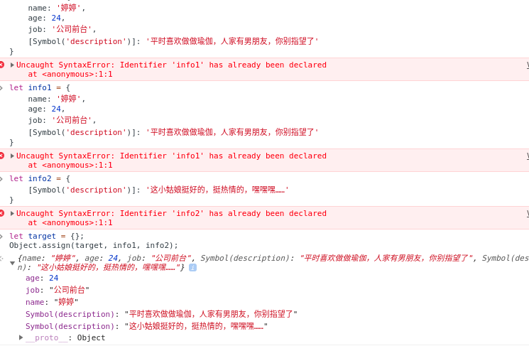

# ES6
## 简单了解ES6与ES2015 Symbol() 方法
symbol的中文意思是：符号；象征；标志；记号等。

Symbol的作用是什么？
Symbol的作用非常的专一，换句话说其设计出来就只有一个目的——作为对象属性的唯一标识符，防止对象属性冲突发生。

举个例子，你看上了公司前来的前台妹纸，想了解关于她的更多信息，于是就询问Hr同事，扫地阿姨，于是得到类似这样信息：
```
let info1 = {
    name: '婷婷',
    age: 24,
    job: '公司前台',
    [Symbol('description')]: '平时喜欢做做瑜伽，人家有男朋友，你别指望了'
}

let info2 = {
    [Symbol('description')]: '这小姑娘挺好的，挺热情的，嘿嘿嘿……'
}

let target = {};
Object.assign(target, info1, info2);
```


## es6一共有6种声明变量的方法
es6一共有6种声明变量的方法

var命令、function命令、let命令、const命令、import命令、class命令

全局对象windows， 变量由var定义则可用，由let定义无用

## let命令
es6新增了let命令，用于声明变量。其用法类似于var，但是所声明的变量只在let命令所在的代码块内有效。
```
{
let a=10;
var b=1;
}
a//a is not defined
b//1
```

结果let声明的变量报错，var声明的变量返回正确值。

这表明，let声明的变量只在其所在的代码块有效。

for循环的计数器，就很适合使用let命令。
```
for（let i=0;i<arr.length;i++）
{
}
console.log(i)
referenceError
以上代码中的计数器i，只在for循环体内有效。
下面的代码如果使用var，最后输出10
var a=[]，
for(var i=0;i<10;i++)
{
a[i]=function(){
console.log(i)
}
}
```

上面的代码中，变量i是var声明的，在全局范围内都有效。所以每一次循环，新的i值都会覆盖旧值，导致最后输出的是最后一轮的i值，

如果使用let，声明的变量就在块级作用域内有效，最后输出将是6

变量i是let声明。当前i只在本轮循环有效，所以每一次循环的i其实都是一个新的变量，于是最后输出6.
### 不存在变量提升

let不想var那样会发生“变量提升现象”。所以，变量一定要在声明后使用，否则报错，console.log(foo)

let foo=2

上面的代码在声明foo之前就使用这个变量，结果抛出一个错误

这也意味着typeof不再是一个百分之百安全的操作。

typeof x;

let x;

代码未声明，就会抛出referenceerror
### 暂时性死区
只要块级作用域内存在let命令，他所声明的变量就“绑定”(binding)这个区域，不再受外界的影响。
```
var tmp=2123；
if（true）{
tmp=‘abc’;
let tmp;}
```
上面的代码中存在全局变量tmp，但是块级作用域内let有声明了一个局部变量tmp，导致后者绑定这个块级作用域，所以在let声明变量前，对tmp赋值会报错。

es6明确规定，如果区块中存在let和const命令，则这个区块对这些命令声明的变量从一开始就形成封闭作用域。只要在声明之前就使用这些变量，就会报错。

总之，在代码块内，使用let命令声明变量之前，该变量都是不可用的。

这在语法上称为“暂时性死区”。

在let命令声明变量tmp之前，都属于变量tmp的“死区”。

有些死区比较隐蔽。不太容易发现。

调用bar函数之所以报错。是因为参数x的默认值等于另一个参数y，而此时y还没有声明，属于死区。如果y的默认值是x就不会报错，因为此时x已声明。

es6规定暂时性死区和不存在变量提升，主要是为了减少运行时错误，防止在变量声明前就使用这个变量，从而导致意料之外的行为，这样的错误在es5中是很常见的，现在有了这种规定避免此类错误就很容易了。

总之，暂时性死区的本质就是只要一进入当前作用域，所要使用的变量就已存在，但是不可获取只有等到声明变量的哪一行代码出现，才可以获取和使用改变量。

### 不允许重复声明

let不允许在相同作用域内重复声明同一个变量。

### 块级作用域

为什么需要块级作用域

es5只有全局作用域和函数作用域，没有块级作用域，这带来了很多不合理的场景。

1. 内层变量可能会覆盖外层变量

2. 用来计数的循环变量泄露为全局变量

es6的块级作用域
let实际上为javascript新增了块级作用域

外层代码块不受内层代码块的影响。

es6允许块级作用域任意嵌套

内层作用域可以定义外层作用域的同名变量

块级作用域的出现，实际上使得获得广泛应用的立即执行匿名函数不再必要。

需要注意的是，如果在严格模式下，函数只能在顶层作用域和函数内声明，其他状况比如if代码块循环代码块下的声明都会报错。
