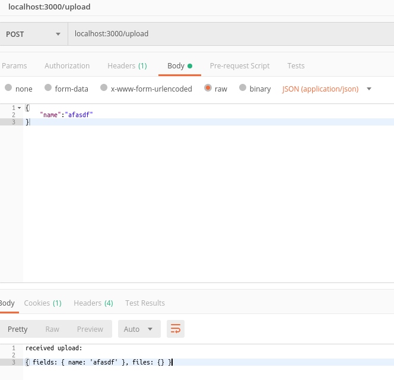

# express从入门到放弃

## Passport-Local Mongoose
Passport Local Mongoose是一个Mongoose插件，它简化了使用Passport建立用户名和密码登录的过程。

### 教程
Michael Herman在他的博客post user authentication with passport.js中给出了一个简单易懂的步骤，用于设置mongoose、passport、passport local和passport local mongoose进行用户身份验证。

### 安装
```bash
npm install passport-local-mongoose
```

Passport Local Mongoose不直接要求Passport、Passport Local或Mongoose依赖项，但希望您安装这些依赖项。
如果需要安装整个依赖项集

```bash
npm install passport passport-local mongoose passport-local-mongoose --save
```

### 用法
#### 插件Passport本地Mongoose
首先，您需要将Passport本地Mongoose插入到您的用户模式中。

```javascript
const mongoose = require('mongoose');
const Schema = mongoose.Schema;
const passportLocalMongoose = require('passport-local-mongoose');
 
const User = new Schema({});
 
User.plugin(passportLocalMongoose);
 
module.exports = mongoose.model('User', User);
```
你可以自由地定义你的用户。passport local mongoose将添加一个用户名、哈希和salt字段来存储用户名、哈希密码和salt值。
此外，passport local mongoose还为您的模式添加了一些方法。有关更多详细信息，请参阅API文档部分。

#### 配置本地Passport/Passport
您应该按照Passport指南中的描述在本地配置Passport/Passport。
passport local mongoose通过实现localstrategy和serializeuser/deserializeuser函数来支持此设置。
要设置Passport本地Mongoose，请使用此代码
```javascript
// requires the model with Passport-Local Mongoose plugged in
const User = require('./models/user');
 
// use static authenticate method of model in LocalStrategy
passport.use(new LocalStrategy(User.authenticate()));
 
// use static serialize and deserialize of model for passport session support
passport.serializeUser(User.serializeUser());
passport.deserializeUser(User.deserializeUser());
```

确保有一个Mongoose连接到MongoDB，然后就完成了。
#### 简化的护照/护照本地配置
从0.2.1版passport local mongoose开始，将helper方法createstategy作为静态方法添加到您的模式中。CreateStegy负责使用正确的选项设置Passport本地本地策略。
```javascript
const User = require('./models/user');
 
// CHANGE: USE "createStrategy" INSTEAD OF "authenticate"
passport.use(User.createStrategy());
 
passport.serializeUser(User.serializeUser());
passport.deserializeUser(User.deserializeUser());
```
此功能的原因是，当使用用户名字段选项指定其他用户名字段名称（例如“email”passport local）时，仍然希望前端登录表单包含名为“username”而不是电子邮件的输入字段。这可以配置为本地Passport，但这是工作的两倍。所以我们实现了这个快捷方式。

#### 异步/等待
从5.0.0版开始，passport local mongoose通过返回除serializeuser和deserializeuser之外的所有实例和静态方法的承诺来实现异步/等待。
```javascript
const user = new DefaultUser({username: 'user'});
await user.setPassword('password');
await user.save();
const { user } = await DefaultUser.authenticate()('user', 'password');
```

#### 选项
插入Passport本地Mongoose插件时，可以提供其他选项来配置哈希算法。

```javascript
User.plugin(passportLocalMongoose, options);
```

##### 主要选项|作用
--|--
saltlen|以字节为单位指定salt长度。默认值：32
迭代次数|指定pbkdf2哈希算法中使用的迭代次数。默认值：25000
keylen|指定生成的密钥的长度（以字节为单位）。默认值：512
DigestAlgorithm|指定PBKDF2摘要算法。默认值：sha256。（获取crypto.gethashes（）支持的算法列表）
interval|指定登录尝试之间的间隔（以毫秒为单位），该间隔根据失败的尝试次数以指数形式增加，直到maxinterval。默认值：100
MaxInterval|指定可以锁定帐户的最长时间。默认30000（5分钟）
用户名字段|指定保存用户名的字段名。默认为“用户名”。如果要使用其他字段保存用户名，例如“email”，则可以使用此选项。
username unique|指定是否应通过MongoDB索引强制username字段为唯一字段。默认为true。
salt field|指定保存salt值的字段名。默认为“salt”。
hash field|指定保存密码哈希值的字段名。默认为“hash”。
attemptsfield|指定自上次成功登录以来保存登录失败次数的字段名。默认为“尝试”。
last login field|指定保存上次登录尝试时间戳的字段名。默认为“last”。
selectfields|指定要从MongoDB中选择（并存储在会话中）的模型字段。默认为“未定义”，以便选择模型的所有字段。
用户名小写|保存查询时将用户名字段值转换为小写。默认为“false”。
PopulateFields|指定要在findbyusername函数中填充的字段。默认为“未定义”。
编码|指定生成的salt和散列将存储在其中的编码。默认为“hex”。
limittents|指定是否应限制登录尝试，并处罚登录失败。默认值：假。
maxattempts|指定阻止登录前允许的最大失败尝试次数。默认值：无穷大。
密码验证程序|以“函数（密码，cb）”的形式指定密码的自定义验证函数。默认：验证非空密码。
UsernameQueryFields|指定用于标识用户的模型的可选字段（例如电子邮件）。
findbyusername|指定使用查询参数执行的查询函数，以使用额外的查询参数限制查询。例如，仅查询字段“active”设置为true的用户。默认值：函数（model，queryparameters）返回model.findone（queryparameters）；。有关用例，请参见示例部分。

注意！在生产环境中更改任何哈希选项（saltlen、迭代或keylen）都将阻止现有用户进行身份验证！

##### Hash Algorithm
Passport本地Mongoose使用节点加密库的pbkdf2算法。选择pbkdf2是因为平台独立（与bcrypt相反）。为每个用户保存一个生成的salt值，使彩虹表攻击更加困难。

### API 文档
#### 实例方法
##### setPassword(password, [cb])
设置用户密码。不保存用户对象。如果没有提供回调cb，则返回承诺。
##### changePassword(oldPassword, newPassword, [cb])
更改用户的密码哈希和salt并保存用户对象。如果没有提供回调cb，则返回承诺。如果旧密码与用户的旧密码不匹配，将向cb传递一个不正确的密码错误，或拒绝该承诺。
##### authenticate(password, [cb])
验证用户对象。如果没有提供回调cb，则返回承诺。
#### resetAttempts([cb])
如果没有提供回调cb，则重置用户的密码尝试失败次数（仅在options.limitteries为true时定义），并返回承诺。
##### 回调参数
- err
  - 除非hasing算法引发错误，否则为空
- thisModel
  - 如果验证成功，则获得身份验证的模型，否则为假
- passwordErr
  - authenticationError的一个实例，描述密码失败的原因，否则是未定义的。
  - 
使用setpassword（）只会更新文档的密码字段，但不会保存文档。要提交更改的文档，请记住在使用setpassword（）之后使用mongoose的document.save（）。
#### 错误处理

- `IncorrectPasswordError`：指定密码不正确时返回的错误消息。默认为“不正确的密码”。
- `IncorrectUsernameError`：指定用户名不正确时返回的错误消息。默认为“不正确的用户名”。
- `MissingUsernameError`：指定注册期间未设置用户名时返回的错误消息。默认为“未设置字段%s”。
- `MissingPasswordError`:指定注册期间未设置密码时返回的错误消息。默认为“密码参数未设置！”.
- `UserExistsError`：指定注册期间用户已存在时返回的错误消息。默认为“已存在名为%s的用户”。
- NoAltValueStored：在MongoDB集合中未存储salt值时发生。
- `AttemptTooSoonError`：如果选项limitattempts设置为true，并且在用户仍受到惩罚时发生登录尝试，则会发生此错误。
- `TooManyAttemptsError`：由于登录尝试失败太多，用户帐户被锁定时返回。

如果需要更一般的错误类来进行检查，那么所有这些错误都继承自`AuthenticationError`。
#### 静态方法
静态方法在模型构造函数上公开。例如，要使用`createstategy`函数，请使用
```
const user=需要（“./models/user”）；
user.createstategy（）；
```
- `authenticate（）`生成在Passport的本地策略中使用的函数
- `serializeuser（）`生成一个函数，Passport使用该函数将用户序列化到会话中。
- `deserializeuser()`生成一个函数，Passport使用该函数将用户反序列化到会话中。
- `register(user, password, cb) `方便方法，用给定的密码注册新的用户实例。检查用户名是否唯一。请参见登录示例。
- `findByUsername()`通过其唯一用户名查找用户实例的方便方法。
- `createStrategy()` 创建可在Passport中使用的已配置Passport本地本地策略实例。
### 例子
仅允许“活动”用户进行身份验证
首先，我们定义一个模式，其中有一个类型为boolean的`active`字段。
```
var UserSchema = new Schema({
  active: Boolean
});
```
插入`Passport-Local Mongoose`时，我们将`usernameUnique`设置为避免在字段`username`上创建唯一的`mongodb`索引。为了避免`MongoDB`查询非活动用户，我们可以指定`findByUsername`选项，该选项允许我们限制查询。在我们的示例中，我们希望将查询限制为仅查询字段`active`设置为`true`的用户。`findByUsername`必须返回`Mongoose`查询。
```javascript
UserSchema.plugin(passportLocalMongoose, {
  // Needed to set usernameUnique to true to avoid a mongodb index on the username column!
  usernameUnique: false,
 
  findByUsername: function(model, queryParameters) {
    // Add additional query parameter - AND condition - active: true
    queryParameters.active = true;
    return model.findOne(queryParameters);
  }
});
```
要测试实现，我们只需创建（注册）一个字段`active`设置为`false`的用户，然后在第二步中尝试对该用户进行身份验证：
```javascript
var User = mongoose.model('Users', UserSchema);
 
User.register({username:'username', active: false}, 'password', function(err, user) {
  if (err) { ... }
 
  var authenticate = User.authenticate();
  authenticate('username', 'password', function(err, result) {
    if (err) { ... }
 
    // Value 'result' is set to false. The user could not be authenticated since the user is not active
  });
});
```

## Formidable

### 目的

用于解析表单数据，尤其是文件上载的node.js模块。

### 当前状态

需要维修人员：请参阅https://github.com/felixge/node-formable/issues/412
这个模块是为Transloadit开发的，这是一个专注于上传和编码图像和视频的服务。它经过了数百GB的文件上传测试，从各种各样的客户机上传，被认为是生产就绪。

### 特征

- 快速（约500MB/秒），非缓冲多部分分析器
- 自动将文件上载写入磁盘
- 低内存占用
- 优雅的错误处理
- 非常高的测试覆盖率

### 安装
```
npm i -S formidable
```
这是一个低级包，如果您使用的是高级框架，那么它可能已经包含在内了。但是，Expressv4不包括任何多部分处理，body解析器也不包括。
注意：强大需要轻而易举地运行单元测试，但您不需要它来仅仅使用库。

### 例子
分析传入文件上载。

```js
var formidable = require('formidable'),
    http = require('http'),
    util = require('util');
 
http.createServer(function(req, res) {
  if (req.url == '/upload' && req.method.toLowerCase() == 'post') {
    // parse a file upload
    var form = new formidable.IncomingForm();
 
    form.parse(req, function(err, fields, files) {
      res.writeHead(200, {'content-type': 'text/plain'});
      res.write('received upload:\n\n');
      res.end(util.inspect({fields: fields, files: files}));
    });
 
    return;
  }
 
  // show a file upload form
  res.writeHead(200, {'content-type': 'text/html'});
  res.end(
    '<form action="/upload" enctype="multipart/form-data" method="post">'+
    '<input type="text" name="title"><br>'+
    '<input type="file" name="upload" multiple="multiple"><br>'+
    '<input type="submit" value="Upload">'+
    '</form>'
  );
}).listen(8080);
```


### API

#### Formidable.IncomingForm
```js
var form = new formidable.IncomingForm()
```
创建新的传入表单。
```js
form.encoding = 'utf-8';
```
设置传入表单域的编码。
```js
form.uploadDir = "/my/dir";
```
设置用于放置文件上载的目录。稍后可以使用fs.rename（）移动它们。默认值为os.tmpdir（）。
```js
form.keepExtensions = false;
```
如果希望写入Form.UploadDir的文件包含原始文件的扩展名，请将此属性设置为true。
```js
form.type
```
“multipart”或“urlencoded”取决于传入请求。
```js
form.maxFieldsSize = 20 * 1024 * 1024;
```
限制所有字段（文件除外）可以按字节分配的内存量。如果超过此值，将发出“错误”事件。默认大小为20MB。
```js
form.maxFileSize = 200 * 1024 * 1024;
```
限制上载文件的大小。如果超过此值，将发出“错误”事件。默认大小为200MB。
```js
form.maxFields = 1000;
```

限制查询字符串分析器将解码的字段数。默认值为1000（0表示无限制）。

```js
form.hash = false;
```
如果要为传入文件计算校验和，请将其设置为“sha1”或“md5”。


```js
form.multiples = false;
```
如果启用此选项，则在调用form.parse时，“文件”参数将包含用于输入的文件数组，这些输入使用html5 multiple属性提交多个文件。
```js
form.bytesReceived
```
到目前为止为此表单接收的字节数。
```js
form.bytesExpected
```
此表单中的预期字节数。
```js
form.parse(request, [cb]);
```
解析包含表单数据的传入node.js请求。如果提供了cb，则收集所有字段和文件并将其传递给回调：
```js
form.parse(req, function(err, fields, files) {
  // ...
});
 
form.onPart(part);
```
如果您希望直接访问多部分流，则可以覆盖此方法。这样做将禁用否则将发生的任何“字段”/“文件”事件处理，使您完全负责处理该处理。

```js
form.onPart = function(part) {
  part.addListener('data', function() {
    // ...
  });
}
```

如果你想使用强大的只为你处理某些部分，你可以这样做：

```js
form.onPart = function(part) {
  if (!part.filename) {
    // let formidable handle all non-file parts
    form.handlePart(part);
  }
}
```
检查此方法中的代码以获得进一步的启发。

#### Formidable.File
```js
file.size = 0
```
the size of the上传文件的字节。如果上传的文件仍然存在（见“filebegin事件的性质），这是说这么多字节的文件已经老化。

```js
file.path = null
```

正在写入此文件的路径。您可以在“filebegin”事件中对此进行修改，以防不满意可怕的文件生成临时路径的方式。
```js
file.name = null
```
根据上载客户端，此文件的名称。

```js
file.type = null
```
包含此文件上次写入时间的日期对象（或空值）。主要是为了与W3C文件API草稿兼容。
```js
file.hash = null
```
如果设置了哈希计算，则可以从该变量中读取十六进制摘要。


#### Formidable.File#toJSON()
此方法返回文件的JSON表示，允许您使用json.stringify（）文件，该文件可用于记录和响应请求。

### 事件
#### progress

在解析了每个传入数据块之后发出。可用于滚动您自己的进度条。
```js
form.on('progress', function(bytesReceived, bytesExpected) {
});
```
#### field

每当接收到字段/值对时发出。
```js
form.on('field', function(name, value) {
});
```

#### fileBegin
每当在上载流中检测到新文件时发出。如果要在文件系统上缓冲上载时将文件传输到其他地方，请使用此事件。

```js
form.on('fileBegin', function(name, file) {
});
```
#### file
每当接收到field/file对时发出。file是file的实例。

```js
form.on('file', function(name, file) {
});
```

#### error
处理传入表单时出错时发出。遇到错误的请求将自动暂停，如果您希望请求继续触发“数据”事件，则必须手动调用`request.resume（）`。
```js
form.on('error', function(err) {
});
```

#### aborted
在用户中止请求时发出。现在，这可能是由于套接字上的“超时”或“关闭”事件造成的。此事件发出后，将发生错误事件。将来会有一个单独的“超时”事件（需要在节点核心中进行更改）。
```js
form.on('aborted', function() {
});
```

#### end

```js
form.on('end', function() {
});
```
在接收到整个请求并且所有包含的文件都已完成刷新到磁盘时发出。这是一个很好的地方，您可以发送您的回复。


### 解析
其中当服务端全部接收完客户端用post方式提交的表单数据之后，触发执行该回调函数。以post方式提交的表单域数据都放在fields这个对象当中，以post方式上传的文件、图片等文件域数据都放在files这个对象当中。

## bug
```
(node:1401) UnhandledPromiseRejectionWarning: MongoError: insertDocument :: caused by :: 11000 E11000 duplicate key error index: xalert.groups.$username_1  dup key: { : null }
```
解决
```
> db.groups.getIndexes()
[
	{
		"v" : 1,
		"key" : {
			"_id" : 1
		},
		"name" : "_id_",
		"ns" : "xalert.groups"
	},
	{
		"v" : 1,
		"unique" : true,
		"key" : {
			"username" : 1
		},
		"name" : "username_1",
		"ns" : "xalert.groups",
		"background" : true
	}
]

> db.groups.dropIndex({'username':1})
{ "nIndexesWas" : 2, "ok" : 1 }
> db.groups.dropIndex({'username':1})
{
	"nIndexesWas" : 1,
	"ok" : 0,
	"errmsg" : "can't find index with key:{ username: 1.0 }"
}
> db.groups.getIndexes()
[
	{
		"v" : 1,
		"key" : {
			"_id" : 1
		},
		"name" : "_id_",
		"ns" : "xalert.groups"
	}
]

```

## 参考文献
[passport+express+mongoose纯干货手打教程+简单项目框架](https://www.jianshu.com/p/a222ad8db47d)


[formidable](https://www.npmjs.com/package/formidable)

[Passport-Local Mongoose](https://www.npmjs.com/package/passport-local-mongoose)

[formidable处理提交的表单或图片文件的简单介绍](https://segmentfault.com/a/1190000011424511#articleHeader1)

['E11000 duplicate key error collection: moviesProject.users index: username_1 dup key: { : null }](https://blog.csdn.net/colin_zff/article/details/77870191)