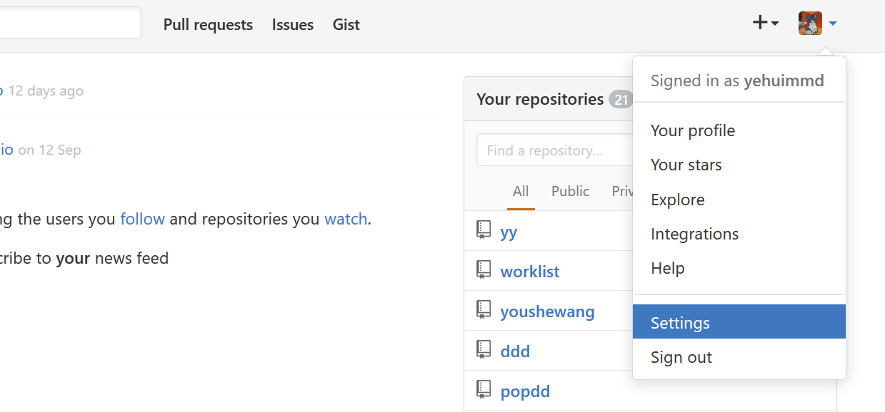
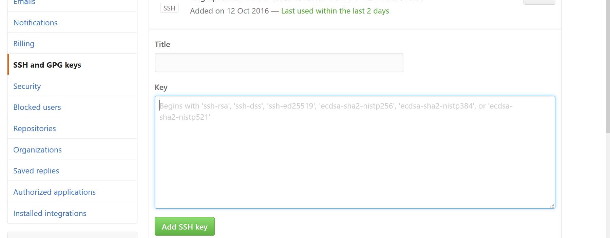
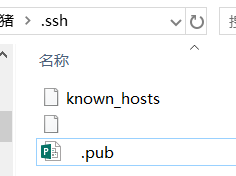

# GITHUB

## github平台如何回退代码到历史指定版本
github平台如何回退代码到历史指定版本

前提是 本地已经有了 git的origin master库 
或者克隆需要回退的代码到本地

1.  查询历史对应不同版本的ID ，用于回退使用
```
$ git log --pretty=oneline
```

使用git log命令查看所有的历史版本，获取你git的某个历史版本的id
       假设查到历史版本的id是fae6966548e3ae76cfa7f38a461c438cf75ba965。
2. 恢复到历史版本
```
$ git reset --hard fae6966548e3ae76cfa7f38a461c438cf75ba965
```


3. 把修改推到远程服务器
```
$ git push -f -u origin master  
```

4. 重新更新就可以了
```
git pull
```

## code的外卖配送员-git

我叫git,我每天要和很多代码和很多程序猿打交道,其实我就是一个普普通通的外卖配送员,不像美团和饿了吗,他们是配送各种美食,想想我就饿了,我配送的是代码.
我为我的职业感到高兴.
一般我就两条主路线和三个市一个区,如图


你说巧不巧,有人点单了,程序猿小飞点了从workspace到remote的大订单,我们看看吧.
### 那我得走workspace市->index县->repository市>remote市的路线
```
如果当前订单已经在remote市,那么就要先销毁与这个订单的链接
git remote remove origin
然后初始化订单
git init
重新关联remote市的链接
git remote add origin [仓库]
我骑着小毛驴,遵守交通规则把订单从workspace市配送到index县,index县有一个温泉,我累死了,得休息一下,泡着舒服的温泉,我想想今天点啥外卖呢?
git add .
当然我也可以配送指定订单
git add 文件名
但是总是在我泡温泉的时候,小飞会打来电话要我带一句话,很无奈,我带着index县的订单和那句话继续骑行一百公里,向repository市进发,在路上我看见了许多同事,还可他们打了个招呼.
git commit -m "注释内容"
看看前面耽误的时间太多,我也就没有休息了,加足马力,带着订单和话前往remote市,我好舒服啊记得是叫做master的区吧,速度,不然的话,小飞要投诉我了.
git push --set-upstream origin master
当然有时候我会送到dev区
git push origin dev
终于将订单配送到了,而且时间刚刚好.嘿嘿,那个温泉好舒服啊.
我到了后,碰到了同事小仇,他说中午点啥子外卖哦,去外婆家撮一顿,我一听,想起那块美滋滋的红烧肉,我就跟着小仇去了.
你说巧不巧,我刚吃完,程序猿小鸿就给我在网上下了订单需要我将订单从remote配送到workspace去

```
### 那我得往回走remote市->repository市->workspace路线
```
我拔掉我的爱驴的充电器,好在爱驴在每个地方都充电,电还是蛮多的,我从remote市往repository市骑行,
git fetch /git clone 链接
然后我从repository市往workspace市骑行,
git checkout 
这个是放在workspace市的master区
当然也可以放在其他区,比如dev区,
gitg checkout dev
有时候特急订单我会走remote市->workspace市的路线
我就直接将订单拿上飞速前往目的地
git pull

```
时间真的过得快,晚饭时间到了,我火速前往餐厅吃饭,准备晚上大战

## You are not allowed to push code to protected branches on this project
[git合并分支成功，但是push失败(remote: GitLab: You are not allowed to push code to protected branches on this project.)](https://www.cnblogs.com/hcy-fly/p/9008323.html)

## ssh_key配置
步骤
1. 输入cd ~/.ssh——回车（看你是否有了ssh key 密钥，有了就备份）；

2. 输入ssh-keygen -t rsa -C "your email"——直接回车，之后会让你输入github的账号密码，会出现如图所示结果，跟着上面所指示的路径，在你的电脑中找到该文件，id_rsa文件即是你的私有密钥，id_rsa.pub是共开密钥


3. 打开你的id_rsa.pub文件，复制下里面的内容，然后登录进去你的github；


4. 在右上角账户那里点击头像边上的下拉，出现如图——点击settings进去，找到左侧的SSH Keys,点击，如图；



5. 在点击Add SSH Key，在title处填入任意的标识，在Key部分里面添加刚才复制的id_rsa.pub文件里的内容，点击添加即可；



6. 添加成功


7. 最后一步了，只需测试一下链接是否正常了，接着输入：ssh -T git@github.com，


这样，我们的git配置就完成了。


::: tip
git不需要密码

Enter passphrase (empty for no passphrase)

Enter file in which to save the key 为空的话，创建的就是空的



:::


## 上传GitHub怎么忽略node_modules
简单说就是在根目录下创建.gitignore，然后编辑过滤规则。
windows下怎么操作，方法如下：
1. 是常规的windows操作
> 根目录下创建gitignore.txt；

>编辑gitignore.txt，写下你的规则，例如加上node_modules/；

>打开命令行窗口，切换到根目录（可以直接在文件夹上面的地址栏输入cmd回车）；

>执行命令ren gitignore.txt .gitignore。

2. 是用Git Bash
>根目录下右键选择“Git Bash Here”进入bash命令窗口；


>输入vim .gitignore命令，打开文件（没有文件会自动创建）；

>按i键切换到编辑状态，输入规则，例如node_modules/，然后按Esc键退出编辑，输入:wq保存退出。

>git rm -r –cached .再push

其他类Linux环境的，直接打开命令窗口执行Git Bash的2,3步就行了。
最后.gitignore的过滤规则是什么，说明如下：
```
node_modules/   表示过滤这个文件夹
*.zip   过滤zip后缀文件
demo.html   过滤该文件
负面清单：设置哪些文件不被过滤
!src/   跟踪该文件夹
!*.js   跟踪java源文件
!index.html 跟踪该文件
```


## [Github在readme添加gif图](https://www.jianshu.com/p/3142755e93c8)


## Another git process semms to be running in this repository, e.g. an editor opene
```
Another git process semms to be running in this repository, e.g. an editor opened by ‘git commit’. Please make sure all processes are terminated then try again. If it still fails, a git process remove the file manually to continue.
```
大概意思就是说，当前已经有了一个编辑器打开了“git commit”指令，请关闭所有git相关的进程重试，否则，请手动删除那个文件。
## git merge
```
git meger 指定分支后
出现冲突
改变冲突后
git add -u
git push即可。
```

## git爬坑之gitclone权限问题
输入账号密码后提示 HTTP Basic: Access denied fatal: Authentication failed 
[参考](https://www.cnblogs.com/VAllen/p/http-basic-access-denied-fatal-authentication-failed.html)

尝试使用这个命令后，用TortoiseGit拉取或推送项目，输入账号密码后，终于正常拉取和推送项目了。
```
git config --system --unset credential.helper
```

