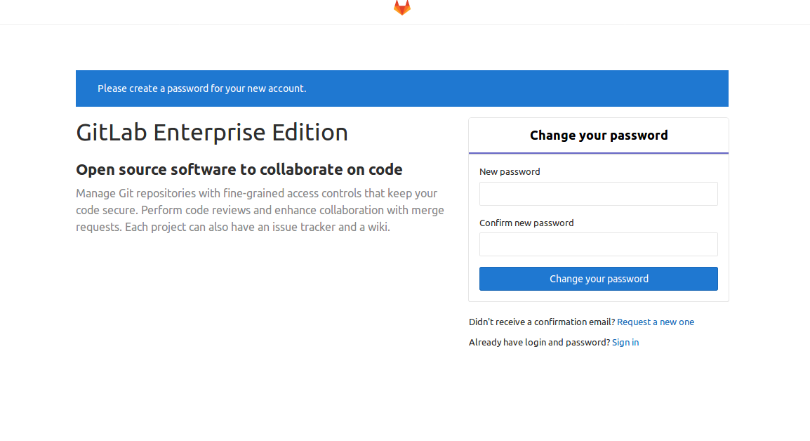

# gitlab的安装和备份
结果是将gitlab-ee_10.7.2-ee.0_amd64.deb版本在新服务器上安装好后，将原服务器上的gitlab备份到新服务器上。
如果不是root用户请在命令前+sudo
## 安装gitlab1
### gitlab官网安装gitlab
首先想用gitlab官网安装gitlab
[gitlab的官方网站](https://about.gitlab.com/install/)


由于的我系统是ubuntu，所以我选择ubuntu
安装步骤就出现在下面了
> 安装和配置必须的依赖
```bash
sudo apt-get update
sudo apt-get install -y curl openssh-server ca-certificates
```
下一步，安装`Postfix`来发送通知邮件。如果你想要用另一个方式去发送邮件，请在gitlab安装好后，下一步就是配置一个额外的SMTP服务。
```bash
sudo apt-get install -y postfix
```
在安装``Postfix`时一个配置屏幕会出现。选择`Internet Site`并且回车。`mail name`为你的服务器的DNS并且回车。如果额外的屏幕出现，继续接受默认配置并且回车。
> 添加gitlab安装包仓库并安装
添加gitlab包仓库
```bash
curl https://packages.gitlab.com/install/repositories/gitlab/gitlab-ee/script.deb.sh | sudo bash
```
下一步，安装gitlab包。选择`https://gitlab.example.com`更改为要访问gitlab实例的url。安装将自动配置并启动gitlab到url。

为了`https://`gitlab将自动请求带有`Let's Encrypt`的证书，这需要入栈http访问和有效的主机名。
```bash
sudo EXTERNAL_URL="https://gitlab.example.com" apt-get install gitlab-ee
```
此时你会发现慢的要死，速度是100k/s，毕竟两者隔了一堵墙。
### 清华镜像安装gitlab
[Gitlab Community Edition 镜像使用帮助](https://mirror.tuna.tsinghua.edu.cn/help/gitlab-ce/)
既然官网太慢，那么我们选择清华镜像安装gitlab，我这边是速度达到30mb/s。
[清华大学开源软件镜像站](https://mirrors.tuna.tsinghua.edu.cn/)

gitlab-ce是社区版
gitlab-ee是企业版
里面有各种版本
备份需要和原服务器的gitlab版本一致，否则无法安装。
在搜索栏里搜索gitlab，就会跳出相关gitlab的版本。
我的`gitlab-ee_10.7.2-ee.0_amd64.deb`版本在`/ubuntu/pool/bionic/main/g/gitlab-ee/`下
或者是直接访问`https://mirrors.tuna.tsinghua.edu.cn/gitlab-ee/ubuntu/pool/bionic/main/g/gitlab-ee/`到gitlab-ee版本下，
直接访问`https://mirrors.tuna.tsinghua.edu.cn/gitlab-ce/ubuntu/pool/bionic/main/g/gitlab-ce/`到gitlab-ce版本下。

> 加入gitlab的GPG公钥
```bash
curl https://packages.gitlab.com/gpg.key 2> /dev/null | sudo apt-key add - &>/dev/null
```
> 写进再选择你的 Debian/Ubuntu 版本，文本框中内容写进`/etc/apt/sources.list.d/gitlab-ce.list`,我是写进`/etc/apt/sources.list.d/gitlab-ee.list`,
写`deb https://mirrors.tuna.tsinghua.edu.cn/gitlab-ee/ubuntu xenial main`
安装 gitlab-ee:
```bash
sudo apt-get update
sudo apt-get install gitlab-ee=10.7.2-ee.0
```
更新apt仓库

下载`gitlab-ee_10.7.2-ee.0`

这样就安装了10.7.2-ee.0版本了。

### 断口被占用
端口80以及端口8080分别被Ubuntu服务器上的Apache、Tomcat和nginx等服务所占用。

我的做法是修改 /etc/gitlab/gitlab.rb 文件


```bash
vim /etc/gitlab/gitlab.rb 
```


### 配置并启动gitlab
```bash
sudo gitlab-ctl reconfigure
```

有时候，像上面步骤修改了GitLab的ip地址一样,临时修改了GitLab的配置之后，得执行如下的命令，应用重新配好的配置并重启GitLab,然后查看GitLab的状态
```bash
sudo gitlab-ctl reconfigure
sudo gitlab-ctl restart
sudo gitlab-ctl status
```
<!--  -->
## 参考文献

[Install ](https://about.gitlab.com/install/#ubuntu)

[ubuntu16.04中gitlab安装](https://blog.csdn.net/weixin_38883338/article/details/82153402)

[gitlab自动备份](https://www.jianshu.com/p/a176789fef21)

[【git学习】在CenterOS系统上恢复GitLab时出现错误：tar: 由于前次错误，将以上次的错误状态退出 unpacking backup failed](https://www.jianshu.com/p/8a287f31a646)

[如何查看 GitLab 版本号](https://blog.csdn.net/wo18237095579/article/details/81106150)

[Linux上Gitlab卸载](https://www.jianshu.com/p/e2e98c45c244)

[git学习------> Gitlab如何进行备份恢复与迁移？](https://blog.csdn.net/ouyang_peng/article/details/77070977)

[【git学习】在CenterOS系统上安装GitLab并自定义域名访问GitLab管理页面](https://blog.csdn.net/ouyang_peng/article/details/72903221)