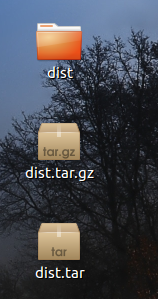
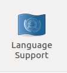
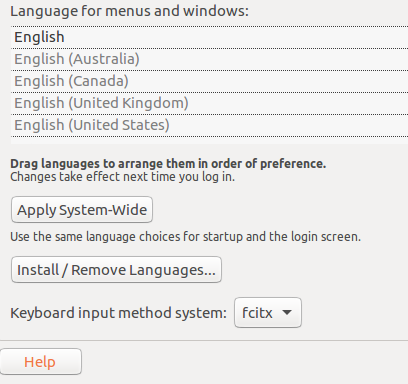
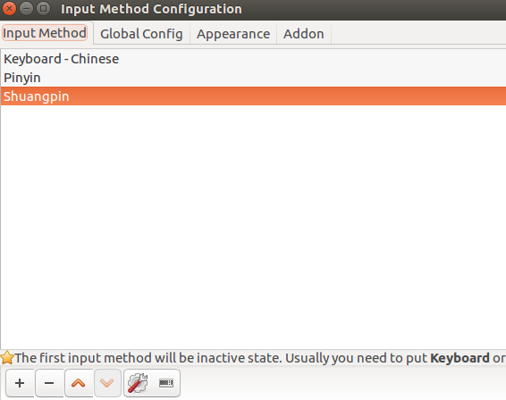

# ubuntu
[[toc]]

## ubuntu打包解包



### 打包
tar zcvf/cvf filename.tar filename

 例:tar cvf dist.tar dist
### 压缩
tar zcvf/cvf filename.tar.gz filename

例 tar zcvf dist.tar.gz dist
### 解压
tar xvf filename.tar.gz filename
tar xvf filename.tar filename

例:tar xvf dist.tar.gz dist
tar xvf dist.tar dist


### ZIP

zip可能是目前使用得最多的文档压缩格式。它最大的优点就是在不同的操作系统平台，比如Linux， Windows以及Mac OS，上使用。缺点就是支持的压缩率不是很高，而tar.gz和tar.gz2在压缩率方面做得非常好。闲话少说，我们步入正题吧：

我们可以使用下列的命令压缩一个目录：

```
 zip -r archive_name.zip directory_to_compress
```

下面是如果解压一个zip文档：

```
 unzip archive_name.zip
```


## ubuntu下webstorm无法输入中文

1. 修改webstorm配置文件
2. vim webstorm.sh在最前面加上
```
export XMODIFIERS=@im=fcitx
export QT_IM_MODULE=fcitx
```
3. 然后保存重新打开即可.

## ubuntu中文输入法

1. 当项目中需要中文输入开发时,可以不用第三方输入法,用fcitx-小企鹅





2. 点击右上角的小企鹅



3. 点击+从里面找到Pinyin


[ubuntu sudo update与upgrade的作用及区别](http://www.baiyuxiong.com/?p=529)
